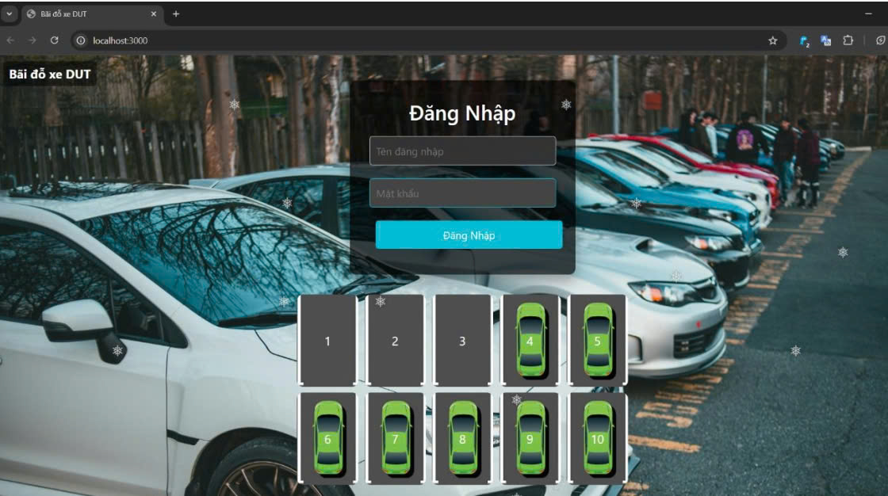

# PBL3 Smart-Parking

## Introduction
- Our products provide a solid and comprehensive foundation of expertise in the field of electronics and programming.
- We are proud to fully meet the requirements for "smart garage"
- The product includes two main parts:
- "Hardware with ESP32, Oled screen, DC motor using Relay, AC motor using Triac, sensors".
- "Software with MQTT communicating with Broker helps to bring information to the web quickly and effectively".
- Each part is designed in detail, taking on separate functions, contributing to creating a complete and effective product.
## How the System Works
### System Overview:

## Quick View of the Project

**Actual interface on Altium Design software**

